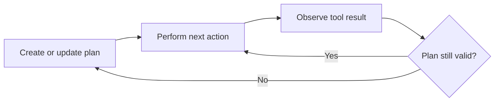

> **Agent planning is the process of turning a goal into smaller actions and deciding which action should happen next.**

## Why is planning needed?

A user gives a goal, not always a complete list of steps:

```plain text
Investigate why yesterday's orders failed and prepare a report.
```

The agent may need to:

1. Query failed orders.
2. Group them by error.
3. Check related service logs.
4. Calculate failure counts.
5. Summarize the likely causes.
6. Create the report.

Planning helps the agent avoid attempting everything in one unstructured response.

## Plan, act, observe, adjust



The agent may change its plan when new information appears.

Example:

```plain text
Original plan:
Check payment-service failures.

Tool result:
Most failures came from invalid inventory reservations.

Updated plan:
Inspect the inventory service instead.
```

This ability to adjust is what makes agent planning different from blindly following a fixed list.

## Fixed plan vs dynamic planning

### Fixed plan

The backend defines all steps:

```plain text
validate → retrieve → generate → validate → save
```

This is predictable and easy to test.

### Dynamic planning

The model chooses the next action based on current state and tool results.

This is useful for uncertain tasks but adds cost and risk.

A reliable system often combines both:

- backend controls the overall workflow
- model makes limited decisions inside approved steps

## What should be stored in agent state?

```json
{
  "goal": "Investigate failed orders",
  "completedSteps": ["Fetched failed orders"],
  "currentFinding": "Most failures involve inventory",
  "nextAction": "Check inventory errors",
  "stepCount": 2
}
```

State prevents the agent from repeating work and helps the backend resume or debug the task.

## Planning does not guarantee good reasoning

The model may:

- create unnecessary steps
- choose the wrong tool
- misunderstand a tool result
- repeat itself
- stop too early
- never stop

The backend should enforce:

- maximum step count
- allowed tools
- time and cost limits
- required completion conditions
- validation of important results

## Ask for decisions, not hidden thoughts

Your application usually needs a concise decision:

```json
{
  "nextTool": "getInventoryErrors",
  "reason": "Most failed orders reference inventory reservations"
}
```

It does not need a long internal reasoning transcript. Store the action, short justification, and result needed for debugging.

## When planning is unnecessary

Do not use an agent loop when the task has one obvious step.

For example:

```plain text
Summarize this paragraph.
```

A direct model call is cheaper and more reliable.

> Planning means **choose a step, act, inspect the result, and adjust** while the backend limits how far the agent can go.
