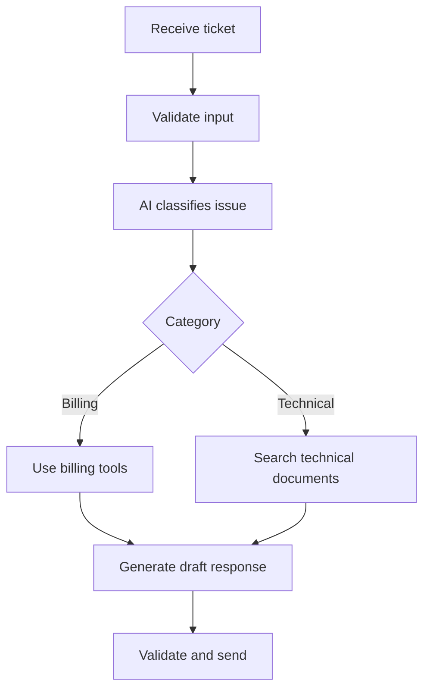

> **An agentic workflow is a controlled process where AI can make limited decisions inside a backend-defined workflow.**

It combines:

- deterministic backend steps
- model decisions where flexibility is useful
- tools for data and actions
- validation and guardrails

## Why use an agentic workflow?

A fully fixed pipeline works well when every step is known:

```plain text
validate → classify → save
```

A fully autonomous agent chooses all steps dynamically, which can be expensive and unpredictable.

An agentic workflow sits between them:

```plain text
Backend controls the overall process
        +
AI chooses within safe boundaries
```

## Example: support-ticket workflow



The workflow is fixed, but the AI chooses the category and may choose a relevant approved tool.

## Common workflow patterns

### Routing

The model chooses which predefined path should handle the request.

```plain text
Ticket → billing, technical, or account workflow
```

### Tool-using loop

The model chooses tools, observes results, and continues until a completion condition is reached.

### Parallel work

Independent AI tasks run at the same time:

```plain text
Generate summary
Check policy compliance
Extract action items
```

### Evaluator and improver

One model creates a draft. Another step checks it against clear criteria and requests improvement if needed.

Use a strict retry limit to prevent endless loops.

## Agentic workflow vs AI pipeline

<table header-row="true">
<tr>
<td>Traditional AI pipeline</td>
<td>Agentic workflow</td>
</tr>
<tr>
<td>Steps are mostly fixed</td>
<td>Some steps are chosen dynamically</td>
</tr>
<tr>
<td>More predictable</td>
<td>More flexible</td>
</tr>
<tr>
<td>Easier to test</td>
<td>Handles uncertain paths better</td>
</tr>
<tr>
<td>Usually cheaper</td>
<td>May need more model and tool calls</td>
</tr>
</table>

## Agentic workflow vs autonomous agent

An agentic workflow gives the model limited freedom inside a controlled application.

An autonomous agent may receive a broad goal and decide most of the process itself.

For production backends, controlled workflows are often safer because the backend defines:

- allowed paths
- available tools
- maximum steps
- approval points
- validation rules
- stopping conditions

## Designing a reliable workflow

1. Use normal code for rules that are already known.
2. Use AI only where interpretation or flexible choice is needed.
3. Give each step a clear input and output.
4. Validate AI output before the next step.
5. Limit retries and tool calls.
6. Require confirmation before sensitive actions.
7. Record state so work can resume safely.
8. Monitor cost, failures, and tool usage.

## Example principle

Do not ask an AI to decide whether a user owns an order.

```javascript
// Deterministic security rule
if (order.userId !== currentUser.id) {
  throw new ForbiddenError();
}
```

Use AI for interpreting the request, not enforcing permissions.

## Common mistakes

- using an agent where ordinary code is enough
- allowing endless loops
- giving the model too many tools
- having no completion condition
- hiding the entire workflow inside one prompt
- letting AI make security or payment decisions
- not saving intermediate state

> The best agentic systems are not maximally autonomous. They give AI flexibility only where it helps and keep important rules in deterministic backend code.
