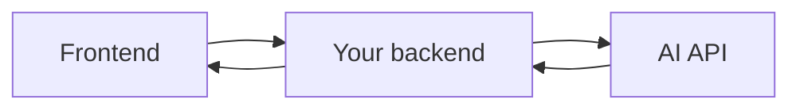

> **An API key is a secret value that identifies and authenticates your backend when it calls an AI provider.**

## Why is it needed?

AI APIs are paid and protected services. The provider needs to know:

- which account is making the request
- whether that account has permission
- whose usage and cost should be recorded
- whether request limits have been exceeded

A request commonly includes the key in an authorization header:

```javascript
Authorization: Bearer YOUR_API_KEY
```

## Correct request flow



The API key stays on your backend.

The frontend calls your backend, and your backend calls the AI provider.

## Never expose the key in frontend code

This is unsafe:

```javascript
// Browser code — do not do this
const API_KEY = "secret-key";
```

Anyone can inspect the browser, copy the key, and use your account.

Store the key in an environment variable:

```bash
AI_API_KEY=your-secret-key
```

Use it on the server:

```javascript
const client = new AIClient({
  apiKey: process.env.AI_API_KEY
});
```

Do not commit the environment file to Git.

## Authentication vs authorization

- **Authentication:** Which application is calling the API?
- **Authorization:** What is that application allowed to do?

The provider authenticates your backend with the API key. Your backend must separately authenticate its own users and decide who can use its AI features.

## Important security practices

- Keep keys only on trusted servers.
- Use separate keys for development and production.
- Rotate a key if it is leaked.
- Give keys the minimum permissions available.
- Set spending and usage limits when supported.
- Do not print keys in logs or error messages.
- Restrict access to production environment variables.

## Your backend still needs user-level protection

One server key may be shared by all users of your application.

Therefore, your backend should track:

- user ID
- number of requests
- tokens used
- permission to access the feature
- rate-limit status

> The AI provider's API key protects the provider account. It does not replace authentication, authorization, or rate limiting inside your own application.

## If a key is leaked

1. Revoke or rotate it immediately.
2. Create a replacement key.
3. Update the production secret.
4. Review usage and billing.
5. Find and remove the source of the leak.

## Final mental model

> **Frontend → your authenticated backend → AI provider.**
>
> The provider key never belongs in the browser.
