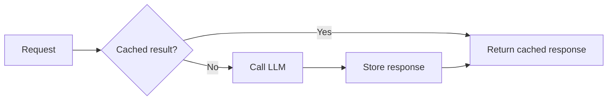

> **LLM caching stores a previous result so the application can reuse it instead of making the same expensive model call again.**

## Why is caching useful?

AI requests can be slower and more expensive than normal database queries.

If many users ask:

```plain text
What is the company's leave policy?
```

and the answer is the same, generating it every time may waste time and money.

## Basic cache flow



## Exact-match caching

Reuse a response only when the cache key is exactly the same.

A useful cache key may include:

```plain text
model
+ prompt-template version
+ normalized user input
+ relevant settings
+ data or document version
+ user or tenant scope
```

If any important input changes, the cache should not return the old result.

## Example

```javascript
const cacheKey = createHash({
  model: "chosen-model",
  promptVersion: "faq-v2",
  question: normalizedQuestion,
  policyVersion: currentPolicyVersion
});

let answer = await cache.get(cacheKey);

if (!answer) {
  answer = await generateAnswer(question);
  await cache.set(cacheKey, answer, { ttl: 3600 });
}

return answer;
```

## TTL and invalidation

**TTL** means time to live: how long a cached result remains valid.

Invalidation means removing the cache when its source data changes.

Example:

```plain text
HR policy updated
    ↓
Old RAG answer may be wrong
    ↓
Delete cache or change policy version in cache key
```

## What is semantic caching?

Semantic caching may reuse an answer for questions with similar meaning:

```plain text
"What is the leave policy?"
"How does annual leave work?"
```

It can improve cache hits, but it is riskier because similar questions are not always identical.

Start with exact caching unless semantic reuse is clearly safe.

## When should you avoid caching?

Be careful with:

- personalized answers
- live balances or order status
- rapidly changing data
- one-time or sensitive requests
- responses affected by user permissions
- actions such as sending email or creating records

Never let one user's private response appear for another user.

## Common mistakes

- using only the raw question as the cache key
- forgetting model or prompt versions
- keeping results after source documents change
- caching errors for too long
- caching sensitive data without user isolation
- assuming every AI response is safe to reuse

> Cache only when the **same effective input should produce a reusable answer**. Correct cache keys and invalidation matter more than simply adding Redis.
