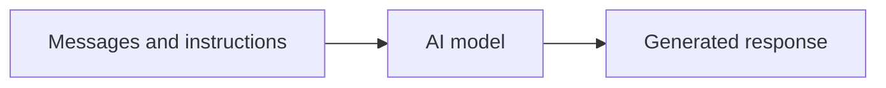

> **Chat completion means sending conversation input to an AI model and receiving generated text as the response.**

## Basic request flow



A request usually contains:

- the model to use
- instructions for the model
- the user's input
- relevant conversation history
- generation settings such as output length

## Roles in a conversation

<table header-row="true">
<tr>
<td>Role</td>
<td>Purpose</td>
</tr>
<tr>
<td>System or developer</td>
<td>Defines behaviour and important rules</td>
</tr>
<tr>
<td>User</td>
<td>Contains the user's request</td>
</tr>
<tr>
<td>Assistant</td>
<td>Contains earlier model responses</td>
</tr>
</table>

Example:

```javascript
const response = await ai.generate({
  instructions: "Explain concepts to a beginner backend developer.",
  input: "What is a load balancer?",
  maxOutputTokens: 500
});

console.log(response.text);
```

Exact SDK syntax differs between providers.

## AI APIs are usually stateless

The API normally does not automatically remember every previous request.

If the conversation is:

```plain text
User: My name is Aman.
AI: Nice to meet you.

User: What is my name?
```

The second request must also provide the relevant earlier information, or use a provider feature that preserves conversation state.

Conceptually:

```javascript
const messages = [
  { role: "user", content: "My name is Aman." },
  { role: "assistant", content: "Nice to meet you." },
  { role: "user", content: "What is my name?" }
];
```

Sending more history uses more input tokens and context-window space.

## Important settings

- **Temperature:** controls how varied token selection is
- **Maximum output tokens:** limits response length
- **Structured output:** asks for validated machine-readable data
- **Tools:** allow the model to request backend actions
- **Streaming:** sends generated text gradually

Not every model exposes every setting.

## What your backend should handle

- validate the user's input
- authenticate and rate-limit the user
- set timeouts
- handle provider errors
- record token usage and cost
- avoid logging sensitive prompts
- return or stream the response

## Common mistakes

- assuming the model remembers previous API calls
- sending the entire conversation forever
- trusting generated facts without verification
- exposing the provider key in the frontend
- not setting an output limit
- parsing free-form text when the application expects JSON

## Final mental model

> A chat API call is simply: **instructions + current input + relevant context → generated output**.
