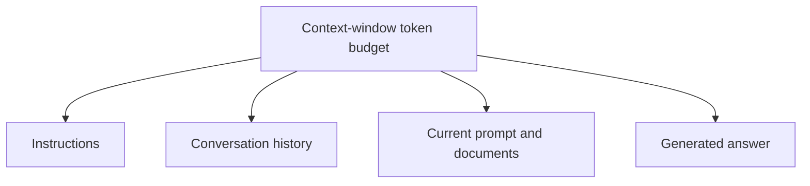

> **The context window is the maximum amount of information an AI model can consider at one time. It is measured in tokens.**

Think of it as the model's **working memory** for the current request.

## What goes inside the context window?

The window may contain:

- system instructions
- developer instructions
- your current message
- previous conversation messages
- uploaded or retrieved documents
- tool results
- the answer being generated



All of these compete for space inside the same token budget.

## Simple example

Assume a model has a **10,000-token context window**.

<table header-row="true">
<tr>
<td>Content</td>
<td>Tokens</td>
</tr>
<tr>
<td>Instructions</td>
<td>1,000</td>
</tr>
<tr>
<td>Conversation history</td>
<td>4,000</td>
</tr>
<tr>
<td>Your new prompt and documents</td>
<td>2,000</td>
</tr>
<tr>
<td>Space remaining for the answer</td>
<td>3,000</td>
</tr>
</table>

```plain text
10,000 - 1,000 - 4,000 - 2,000 = 3,000 tokens remaining
```

This is a simplified example.

Exact input and output limits depend on the model and API.

## What happens when a conversation becomes too long?

The application must usually do one or more of these:

- remove the oldest messages
- summarize earlier messages
- retrieve only the relevant information
- reject the request because it exceeds the limit
- reduce the maximum possible answer length

If an important old detail is removed or summarized badly, the model may answer without it.

### Example

At the beginning, you say:

```plain text
My project uses PostgreSQL. Do not suggest MongoDB.
```

After a very long conversation, that message may no longer be present in the active context.

The AI might then suggest MongoDB because it cannot see the earlier instruction.

## Why long context can still cause mistakes

Even when information technically fits inside the context window, a very long input can make the relevant detail harder to identify.

The model may focus on a more recent or strongly worded instruction.

A larger context window provides more space, but it does **not guarantee perfect memory or reasoning**.

## How to handle long conversations

- Repeat critical requirements when starting a new task.
- Keep instructions short and unambiguous.
- Summarize important decisions.
- Start a fresh conversation when the old discussion is no longer relevant.
- In an AI application, retrieve only the most relevant documents instead of sending everything.
- Store permanent facts in a database; do not rely only on chat history.

> **Context window is temporary working memory, not permanent memory.**

> The model only knows the information currently placed inside its context.

## Context window vs model training

<table header-row="true">
<tr>
<td>Model training</td>
<td>Context window</td>
</tr>
<tr>
<td>Knowledge learned before the conversation</td>
<td>Information supplied for the current request</td>
</tr>
<tr>
<td>Not changed by an ordinary chat</td>
<td>Changes with every message</td>
</tr>
<tr>
<td>Long-term model parameters</td>
<td>Temporary working information</td>
</tr>
</table>

## Interview answer

**The context window is the maximum number of tokens a model can consider during one request. It contains instructions, conversation history, user input, documents, and generated output. When the limit is reached, older or less relevant information may need to be removed, summarized, or retrieved separately.**
