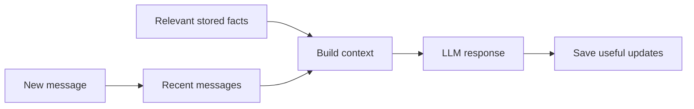

> **Conversation memory is the information an AI application preserves and supplies so the model can continue a conversation consistently.**

The model itself does not automatically remember every previous API call.

## Why is memory needed?

Conversation:

```plain text
User: My project uses PostgreSQL.
AI: Understood.

User: Which database extension should I use for vectors?
```

The second message depends on the first. If the application sends only the latest question, the model may not know that PostgreSQL is being used.

## Types of memory

### Recent conversation history

Send the latest messages with each request.

Good for:

- follow-up questions
- pronouns such as "it" or "that"
- recent decisions

Problem: history grows and uses more tokens.

### Summarized memory

Replace older messages with a short summary:

```plain text
User is building a Node.js backend with PostgreSQL.
They prefer simple explanations and practical examples.
```

This saves tokens but may lose details if the summary is poor.

### Long-term memory

Store important facts in a database:

```json
{
  "userId": 25,
  "preferredDatabase": "PostgreSQL",
  "learningStyle": "simple practical examples"
}
```

Retrieve only relevant facts for the current request.

## Practical memory flow



## Do not store everything forever

Not every message deserves long-term memory.

Store information only when it is:

- useful later
- stable enough
- allowed by the user
- safe to retain

Avoid saving secrets, passwords, payment data, or unnecessary sensitive information.

## Context window is not memory storage

The context window is the temporary information given to one model request.

Your application memory lives outside the model, in a database, cache, or conversation service, and selected parts are placed into the context window.

## A practical strategy

For a basic chatbot:

1. Keep the latest messages.
2. Summarize older conversation.
3. Store important stable preferences separately.
4. Retrieve only facts related to the current question.
5. Let the user view or delete saved memory where appropriate.

## Common mistakes

- sending the complete chat forever
- storing every message as a permanent fact
- trusting AI-generated summaries without checking
- mixing memories between different users
- retrieving unrelated facts
- storing sensitive data without a clear need

> The model does not "remember." The application **stores information and sends the relevant part back to the model**.
