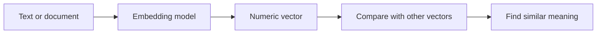

> **An embedding is a list of numbers that represents the meaning of text, an image, or other data.**

It allows a computer to compare information by **meaning**, not just by matching exact words.

## Why are embeddings needed?

Suppose a company policy says:

```plain text
Employees can work remotely during severe weather.
```

A user searches:

```plain text
Can I work from home during heavy rain?
```

The wording is different:

- **work remotely** vs **work from home**
- **severe weather** vs **heavy rain**

A basic keyword search may miss the connection. Embeddings help the system understand that both sentences have similar meanings.

> Embeddings help computers answer: **"Which pieces of information mean something similar?"**

## What exactly is an embedding?

An embedding model converts text into a fixed-length vector, which is an array of numbers.

```plain text
"How do I reset my password?"
              ↓
[0.018, -0.421, 0.735, 0.106, ...]
```

A real vector may contain hundreds or thousands of numbers.

You do not normally interpret each number separately. The complete pattern represents the meaning of the input.

## The main idea: similar meaning, nearby vectors

```plain text
"Reset my password"
"I forgot my login password"
```

These sentences have different words but similar meanings, so their embeddings should be close together.

```plain text
"Reset my password"
"Which helmet should I buy?"
```

These meanings are unrelated, so their embeddings should be far apart.



## How semantic search works

### When storing documents

1. Take a document.
2. Split a large document into smaller chunks.
3. Create an embedding for every chunk.
4. Store the original text and its embedding.

### When the user searches

1. Create an embedding for the user's question.
2. Compare it with stored embeddings.
3. Return the closest matches.

## Clear example

Stored documents:

```plain text
A: Employees may work remotely during severe weather.
B: Passwords must contain at least eight characters.
C: Annual leave requires manager approval.
```

User asks:

```plain text
Can I work from home during a red rain alert?
```

Illustrative similarity results:

<table header-row="true">
<tr>
<td>Document</td>
<td>Similarity</td>
</tr>
<tr>
<td>A: Remote work during severe weather</td>
<td>High</td>
</tr>
<tr>
<td>C: Annual leave approval</td>
<td>Medium or low</td>
</tr>
<tr>
<td>B: Password rules</td>
<td>Very low</td>
</tr>
</table>

The system returns Document A even though the query does not use the exact words **remote work** or **severe weather**.

This is called **semantic search**.

## Keyword search vs embedding search

<table header-row="true">
<tr>
<td>Keyword search</td>
<td>Embedding search</td>
</tr>
<tr>
<td>Matches exact words</td>
<td>Matches similar meaning</td>
</tr>
<tr>
<td>Good for IDs, names, and exact phrases</td>
<td>Good for natural-language questions</td>
</tr>
<tr>
<td>May miss synonyms</td>
<td>Can recognize related words and concepts</td>
</tr>
</table>

Many applications combine both approaches. This is called **hybrid search**.

## How embeddings are used in RAG

Embeddings commonly help an AI find relevant documents before answering.

```plain text
User question
    ↓
Create question embedding
    ↓
Find similar document embeddings
    ↓
Send matching documents to the LLM
    ↓
Generate an answer using those documents
```

The embedding does **not** generate the answer. It only helps retrieve the right information.

The LLM reads the retrieved information and writes the final response.

## Simplified backend example

```javascript
// Create and store a document embedding
const vector = await embeddingModel.embed(
  "Employees can work remotely during severe weather."
);

await documents.insert({
  text: "Employees can work remotely during severe weather.",
  embedding: vector
});
```

When a user searches:

```javascript
const queryVector = await embeddingModel.embed(
  "Can I work from home during heavy rain?"
);

const matches = await documents.findNearest(queryVector);
```

The actual methods depend on the AI provider and database.

## Important things to remember

- Use the **same embedding model** for documents and search queries.
- Store the **original text** along with its embedding.
- Split large documents into meaningful chunks.
- Regenerate an embedding when its original content changes.
- Your backend must still enforce user permissions.
- An embedding represents similarity; it does not prove that information is correct.
- Embeddings are not encryption and should not be treated as anonymous data.

## Embedding model vs LLM

<table header-row="true">
<tr>
<td>Embedding model</td>
<td>Generative LLM</td>
</tr>
<tr>
<td>Produces a numeric vector</td>
<td>Produces text</td>
</tr>
<tr>
<td>Finds similar information</td>
<td>Writes answers and content</td>
</tr>
<tr>
<td>Used for search and retrieval</td>
<td>Used for generation and reasoning</td>
</tr>
</table>

## Common use cases

- semantic search
- retrieving documents for RAG
- recommendations
- finding duplicate support tickets
- matching questions with FAQ entries
- grouping similar content

## Final mental model

> **Embedding model:** converts meaning into numbers.
> **Vector search:** finds nearby meanings.
> **LLM:** uses the retrieved information to generate an answer.

## Interview answer

**An embedding is a numerical vector that represents the semantic meaning of data such as text. Similar meanings produce nearby vectors, allowing applications to perform semantic search and retrieve relevant information for systems such as RAG. Embeddings help find information; they do not generate the final answer.**
