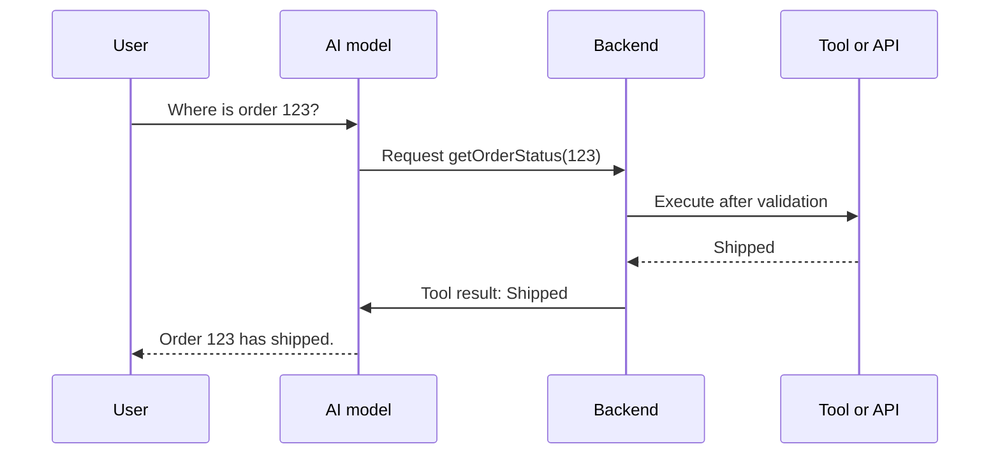

> **Function calling allows an AI model to request that your application use a predefined function or external tool.**

It is also called **tool use**.

## Why is it needed?

An LLM can generate text, but it cannot automatically:

- read your live database
- check today's order status
- send an email
- create a support ticket
- calculate using your private business logic

Your backend provides tools that the model may request.

## Important: the model does not directly execute the function



The backend stays in control.

## Defining a tool

```javascript
const tools = [{
  name: "getOrderStatus",
  description: "Get the current status of an order",
  parameters: {
    type: "object",
    properties: {
      orderId: { type: "integer" }
    },
    required: ["orderId"]
  }
}];
```

The description and schema teach the model when to request the tool and which arguments to provide.

## Backend execution

```javascript
if (toolCall.name === "getOrderStatus") {
  const { orderId } = toolCall.arguments;

  // Validate access before executing
  const order = await getOrderForUser(orderId, currentUser.id);

  const finalAnswer = await ai.generate({
    input: userQuestion,
    toolResult: {
      name: "getOrderStatus",
      result: order.status
    }
  });
}
```

Exact APIs differ, but the responsibility remains the same.

## Why send the result back to the model?

The tool returns raw data:

```json
{
  "status": "shipped",
  "expectedDelivery": "2026-08-07"
}
```

The model converts it into a natural answer:

```plain text
Your order has shipped and is expected on 7 August.
```

## Security rules

Never trust tool arguments merely because the model generated them.

Your backend must:

- validate every argument
- authenticate the user
- check ownership and permissions
- limit which functions are exposed
- request confirmation for sensitive actions
- prevent arbitrary code or SQL execution
- log important actions without exposing secrets

> The model chooses what to **request**. Your backend decides what is actually **allowed and executed**.

## Tool calling vs RAG

- **RAG:** retrieves useful text for the model to read
- **Tool calling:** retrieves live data or performs an action

Example:

- Search HR policy → RAG
- Check current leave balance → tool call
- Submit a leave request → tool call with confirmation

## Common mistakes

- allowing the model to execute code directly
- skipping permission checks
- exposing a powerful general-purpose tool
- performing destructive actions without confirmation
- forgetting to send the tool result back to the model
