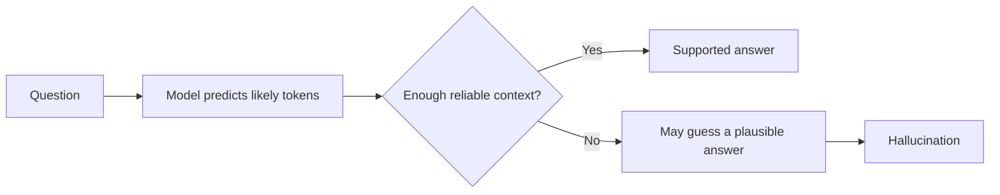

> **A hallucination happens when an AI produces false or unsupported information as if it were correct.**

The answer may sound confident, detailed, and grammatically perfect, even though the information is wrong.

## Simple example

You ask:

```plain text
Which Node.js method permanently caches every API response?
```

There is no standard Node.js method that automatically does this.

A hallucinating model might answer:

```javascript
app.enablePermanentCache();
```

The code looks believable, but the method does not exist.

A better answer would be:

```plain text
Node.js has no built-in method that permanently caches every API response.
You can implement caching with Redis, an in-memory cache, or HTTP cache headers.
```

## Why does hallucination happen?

An AI language model mainly predicts the next likely token.

It does not automatically check every statement against a trusted source.



Common causes include:

- the prompt does not contain enough information
- the question is ambiguous or contains a false assumption
- the model learned incomplete, conflicting, or outdated patterns
- the requested fact is very specific or obscure
- relevant details are missing from a long conversation's active context
- the model is pushed to provide an answer instead of admitting uncertainty
- higher sampling randomness selects a less likely continuation

## Hallucination in long conversations

A long conversation can cause problems in two ways:

### Important information leaves the context window

Older messages may be removed or summarized.

The model cannot use details it can no longer see.

### Relevant information becomes difficult to identify

Even when everything fits, the model may focus on a recent instruction and overlook an older detail.

**Example:**

Earlier message:

```plain text
Our users table uses user_uuid as the primary key.
```

Much later, the AI generates:

```sql
SELECT * FROM users WHERE id = ?;
```

It may have overlooked or lost the original schema detail.

## Types of hallucination

<table header-row="true">
<tr>
<td>Type</td>
<td>Example</td>
</tr>
<tr>
<td>Invented fact</td>
<td>Claiming a person won an award they never received</td>
</tr>
<tr>
<td>Invented source</td>
<td>Providing a research paper or URL that does not exist</td>
</tr>
<tr>
<td>Invented code or API</td>
<td>Using a library method that is not real</td>
</tr>
<tr>
<td>Wrong calculation</td>
<td>Giving a confident but incorrect numerical result</td>
</tr>
<tr>
<td>Context contradiction</td>
<td>Ignoring a requirement stated earlier</td>
</tr>
</table>

## How developers reduce hallucinations

### Give clear context

Provide the schema, documentation, constraints, or data needed for the task.

### Ground the answer with trusted information

Use **RAG** to retrieve relevant company documents and include them in the prompt.

### Use tools

Allow the model to query a database, calculator, search system, or API instead of guessing.

### Permit uncertainty

```plain text
If the answer is not supported by the provided information, say:
"I don't have enough information."
Do not invent facts, methods, or sources.
```

This helps reduce hallucinations, but it cannot remove them completely.

### Require structured output

Ask for evidence or a source beside each important claim.

### Verify important results

Validate code with tests, check API methods against official documentation, and confirm critical facts with trusted sources.

### Keep context relevant

Send the most relevant information instead of filling the context window with unrelated text.

## What does not completely solve hallucination?

- setting temperature to zero
- writing "do not hallucinate"
- using a larger model
- using a larger context window
- asking the same question repeatedly

These may help in some situations, but none guarantees correctness.

> **Fluent does not mean factual.**

> Treat important AI output as a draft until it is verified.

## Interview answer

**AI hallucination is the generation of false or unsupported information that appears convincing. It happens because language models predict likely text rather than automatically verifying every claim. Developers reduce it by providing relevant context, grounding responses with trusted data, using tools, allowing uncertainty, and validating important output.**
