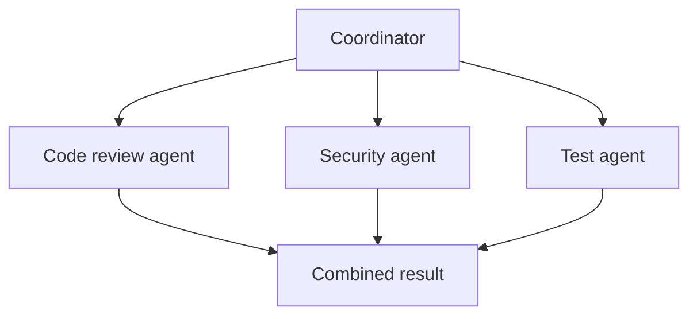

> **A multi-agent system uses multiple agents with different responsibilities to work on one larger goal.**

Instead of one agent doing everything, work is divided among specialized agents.

## Simple example

Goal:

```plain text
Review a backend pull request.
```

Possible agents:

- **Code agent:** checks logic and maintainability
- **Security agent:** looks for authorization and injection problems
- **Test agent:** finds missing tests and edge cases
- **Coordinator:** combines the findings



## Why use multiple agents?

It can help when:

- work can be clearly divided
- different tasks need different instructions or tools
- independent parts can run in parallel
- one agent should review another agent's result

## Common coordination patterns

### Coordinator and specialists

One coordinator divides the task, sends work to specialist agents, and combines the results.

### Parallel workers

Several agents perform independent tasks at the same time.

Example:

```plain text
Research API options
Research database options
Research security requirements
```

### Reviewer pattern

One agent creates a result, and another checks it against clear criteria.

## Shared state and handoffs

Agents need a structured way to communicate:

```json
{
  "task": "Check authorization in order routes",
  "findings": [
    {
      "file": "orders.js",
      "issue": "Ownership is not checked",
      "severity": "high"
    }
  ]
}
```

Structured handoffs are more reliable than sending a long, unorganized chat transcript.

The coordinator should track:

- task assigned to each agent
- completion status
- outputs and evidence
- errors
- total cost and time

## More agents do not automatically mean better results

Multi-agent systems add:

- more model calls
- higher token cost
- longer execution time
- duplicated work
- conflicting answers
- harder debugging
- more security boundaries

For many tasks, one agent with good tools is simpler and better.

## When not to use multiple agents

Avoid them when:

- the task is small
- steps depend heavily on one another
- one agent already performs reliably
- coordination costs more than the work
- different agents would use the same prompt and tools

Start with the simplest design. Add agents only when specialization or parallel work produces measurable improvement.

## Security rules

Each agent should receive only:

- the tools it needs
- the data it is allowed to access
- the task it must perform

A report-writing agent should not receive a payment tool.

> A multi-agent system is a team of specialized AI workers. Use it only when dividing the work is clearer and more valuable than using one capable agent.
