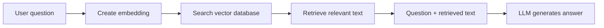

> **RAG is a technique where an AI retrieves relevant information from your data before generating an answer.**

RAG stands for:

- **Retrieval:** find relevant information
- **Augmented:** add that information to the prompt
- **Generation:** let the LLM generate an answer from it

## Why is RAG needed?

An LLM has two important limitations:

- it may not know your private company data
- its learned knowledge may be outdated or incomplete

Suppose you ask:

```plain text
Can employees work from home during a red rain alert?
```

The LLM does not automatically know your company's current HR policy.

Without that information, it may guess and hallucinate.

With RAG, the application first finds the relevant policy:

```plain text
Employees may work remotely during officially declared severe-weather alerts.
```

It then gives the **question and policy** to the LLM.

The model can now answer using the company's actual information.

> RAG is like allowing the AI to **look up the correct notes before answering**, instead of answering only from memory.

## Complete RAG flow



The three concepts work together:

- **Embedding model:** converts meaning into numbers
- **Vector database:** finds relevant information
- **LLM:** reads that information and generates an answer

## RAG has two stages

## Stage 1: Prepare the documents

This is usually done when documents are added or updated.

1. Collect documents such as policies, FAQs, and manuals.
2. Split large documents into smaller chunks.
3. Create an embedding for every chunk.
4. Store each chunk and embedding in a vector database.

```plain text
Company document
      ↓
Split into chunks
      ↓
Create embeddings
      ↓
Store text + vectors
```

### Why split documents into chunks?

If a 100-page document is stored as one large piece:

- its embedding may be too general
- retrieving it wastes context-window space
- the LLM receives lots of unrelated information

Smaller chunks help retrieve only the relevant section.

## Stage 2: Answer a question

This happens every time a user asks something.

1. Create an embedding for the user's question.
2. Search for similar document chunks.
3. Retrieve the best matches.
4. Place those chunks inside the LLM prompt.
5. Ask the LLM to answer using that context.

## Clear example

Stored policies:

```plain text
A: Employees may work remotely during severe-weather alerts.
B: Annual leave requires manager approval.
C: Passwords must be changed every 90 days.
```

User asks:

```plain text
Can I work from home during a red rain alert?
```

The vector database retrieves Policy A.

The application constructs a prompt similar to:

```plain text
Answer using only the provided context.

Context:
Employees may work remotely during officially declared
severe-weather alerts.

Question:
Can I work from home during a red rain alert?

If the context does not contain the answer, say that
you do not have enough information.
```

Possible answer:

```plain text
Yes. According to the provided policy, employees may work
remotely during an officially declared severe-weather alert.
```

The LLM did not memorize the policy.

The application retrieved it and included it in the current context.

## Why not send every document to the LLM?

Sending all documents would:

- consume too many tokens
- increase API cost
- make responses slower
- possibly exceed the context window
- distract the model with unrelated information

RAG selects only the most relevant sections.

## Simplified backend flow

```javascript
// 1. Convert the question into an embedding
const queryVector = await embeddingModel.embed(userQuestion);

// 2. Retrieve relevant documents
const documents = await vectorDatabase.search({
  vector: queryVector,
  limit: 5
});

// 3. Add them to the prompt
const context = documents.map(doc => doc.text).join("\n");

// 4. Ask the LLM
const answer = await llm.generate({
  prompt: `
    Answer using only this context:
    ${context}

    Question: ${userQuestion}
  `
});
```

The exact methods depend on the provider and database.

## Does RAG eliminate hallucinations?

No.

RAG **reduces** hallucinations by providing trusted information, but mistakes can still happen if:

- the wrong document is retrieved
- the useful information is missing
- documents are outdated
- chunks are poorly created
- the LLM ignores or misinterprets the context

For important systems:

- tell the model not to guess
- include sources in the answer
- keep documents updated
- test retrieval with real questions
- verify high-risk answers

## RAG vs normal LLM response

<table header-row="true">
<tr>
<td>Normal LLM response</td>
<td>RAG response</td>
</tr>
<tr>
<td>Uses mainly learned model knowledge</td>
<td>Uses retrieved application data</td>
</tr>
<tr>
<td>May not know private documents</td>
<td>Can answer from private documents</td>
</tr>
<tr>
<td>Knowledge may be outdated</td>
<td>Documents can be updated anytime</td>
</tr>
<tr>
<td>May guess when information is missing</td>
<td>Can be instructed to answer only from context</td>
</tr>
</table>

## RAG vs fine-tuning

<table header-row="true">
<tr>
<td>RAG</td>
<td>Fine-tuning</td>
</tr>
<tr>
<td>Provides information at request time</td>
<td>Changes the model's learned behaviour</td>
</tr>
<tr>
<td>Good for current facts and documents</td>
<td>Good for teaching style or repeated behaviour</td>
</tr>
<tr>
<td>Update the documents when data changes</td>
<td>May require training again</td>
</tr>
</table>

For answering questions from company documents, RAG is usually the more natural starting point.

## Important things to remember

- RAG is a **process**, not a single database or model.
- Retrieval quality determines answer quality.
- Store original text along with embeddings.
- Apply user permissions during retrieval.
- Retrieve only a small number of useful chunks.
- Keep documents and embeddings updated.
- Ask the LLM to say when the answer is not present.
- Include document sources when accuracy matters.

## Final mental model

> **Without RAG:** Ask the LLM to answer from memory.

> **With RAG:** Find relevant notes, give them to the LLM, and then ask it to answer.

## Interview answer

**RAG, or Retrieval-Augmented Generation, is a technique where an application retrieves relevant information from an external knowledge source and adds it to the LLM's prompt before generation. Embeddings and vector search are commonly used for retrieval. RAG helps an LLM answer using current or private data and reduces hallucinations, although it does not eliminate them.**
