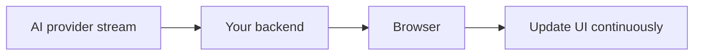

> **Streaming sends an AI response to the user gradually as it is generated, instead of waiting for the complete answer.**

## Without streaming

```plain text
Request → wait for full generation → show complete answer
```

The user may stare at an empty screen for several seconds.

## With streaming

```plain text
Request → receive small chunks → display them immediately
```

Example:

```plain text
"An"
" API"
" key"
" is"
" a secret..."
```

The chunks are not guaranteed to be complete words. Your application joins them into the final response.

## Why is streaming useful?

Streaming mainly improves **perceived speed**.

The total generation time may be similar, but the user sees progress sooner.

It is useful for:

- chat applications
- long explanations
- code generation
- reports and summaries

It is less useful when the backend must receive and validate a complete structured object before showing anything.

## Backend flow



Conceptual server code:

```javascript
const stream = await ai.generate({
  input: userMessage,
  stream: true
});

for await (const event of stream) {
  sendToClient(event.textDelta);
}
```

The backend may relay chunks using Server-Sent Events, a streamed HTTP response, or WebSockets.

## What must be handled?

- connection cancellation
- provider timeouts
- partial output after an error
- duplicate or out-of-order events
- final usage information
- saving the completed response
- stopping generation when the user disconnects

## Streaming and structured output

If valid JSON is streamed piece by piece:

```plain text
{"name":
"Aman","active":
true}
```

The partial content is invalid until generation finishes.

Do not parse or insert it into a database until the complete output has been received and validated.

## Common misunderstanding

Streaming does not mean the model generated the full answer and slowly sent it.

The model is generating tokens while the client receives them.

> Streaming usually improves the **user experience**, not the model's intelligence or total generation speed.
