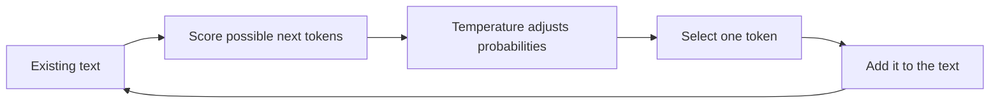

> **Temperature is a generation setting that controls how strongly the model prefers the most likely next token over other possible tokens.**

It does **not** add knowledge to the model. It changes how the model chooses from the knowledge and language patterns it already has.

## First understand how text is generated

An AI does not write the complete answer at once.

It repeatedly performs this process:

1. Read all tokens generated so far.
2. Calculate a score for every possible next token.
3. Convert those scores into probabilities.
4. Select one token.
5. Repeat the process for the next token.



Temperature affects **step 3**, just before a token is selected.

## Why is temperature needed?

There is often more than one sensible continuation for a sentence.

Consider:

```plain text
After finishing work, I like to ___
```

Possible continuations include:

- relax
- read
- exercise
- ride
- cook

If the model always selected only the highest-probability token:

- repeated prompts would produce nearly the same answer
- stories and marketing text could become repetitive
- brainstorming would provide fewer unusual ideas
- the model would avoid less common but interesting word choices

If the model freely selected any token:

- answers could become random
- sentences could lose meaning
- factual responses could become unreliable

**Temperature provides control between these two extremes.**

> Temperature is needed because different tasks require different behavior: **consistency for extraction and coding, but variety for brainstorming and creative writing.**

## What exactly does temperature change?

Before temperature is applied, imagine the model has these possible next-token probabilities:

<table header-row="true">
<tr>
<td>Possible next token</td>
<td>Original probability</td>
</tr>
<tr>
<td>relax</td>
<td>50%</td>
</tr>
<tr>
<td>read</td>
<td>25%</td>
</tr>
<tr>
<td>exercise</td>
<td>15%</td>
</tr>
<tr>
<td>ride</td>
<td>10%</td>
</tr>
</table>

Temperature reshapes this probability distribution before selection.

### Lower temperature: sharp distribution

The most likely token becomes even more dominant.

<table header-row="true">
<tr>
<td>Token</td>
<td>Illustrative probability after low temperature</td>
</tr>
<tr>
<td>relax</td>
<td>80%</td>
</tr>
<tr>
<td>read</td>
<td>14%</td>
</tr>
<tr>
<td>exercise</td>
<td>5%</td>
</tr>
<tr>
<td>ride</td>
<td>1%</td>
</tr>
</table>

The model will probably select **relax**, so the result is more predictable.

### Higher temperature: flatter distribution

The probabilities move closer together.

<table header-row="true">
<tr>
<td>Token</td>
<td>Illustrative probability after high temperature</td>
</tr>
<tr>
<td>relax</td>
<td>35%</td>
</tr>
<tr>
<td>read</td>
<td>27%</td>
</tr>
<tr>
<td>exercise</td>
<td>21%</td>
</tr>
<tr>
<td>ride</td>
<td>17%</td>
</tr>
</table>

Now **ride** or **exercise** has a greater chance of being selected. The answer becomes more varied.

> The numbers above are simplified examples. Temperature does not manually add or subtract a fixed probability. It mathematically reshapes all token scores.

## A little technical detail

The model first produces raw token scores called **logits**.

Temperature is applied before converting logits into probabilities:

```plain text
P(token_i) = e^(z_i / T) / sum(e^(z_j / T))
```

Where:

- `z_i` is the model's raw score for a token
- `T` is temperature
- `P(token_i)` is the adjusted probability

You do not need to calculate this manually. Understand its effect:

- **T below 1:** differences between token scores become stronger
- **T around 1:** the original distribution is roughly preserved
- **T above 1:** differences become smaller
- **T approaching 0:** selection approaches choosing the highest-scoring token

The exact allowed range and behavior depend on the model and API.

## Does low temperature produce the correct result?

**Not necessarily.** It produces the **most likely and consistent result**, not automatically the correct result.

Imagine the model incorrectly believes:

```plain text
The capital of Australia is Sydney.
```

If **Sydney** has the highest score:

- low temperature may select Sydney very consistently
- high temperature might select another answer
- neither setting verifies the real fact

The correct answer is **Canberra**, but temperature itself does not check facts.

```plain text
Low temperature = more predictable
Low temperature ≠ guaranteed correct
```

Correctness mainly depends on:

- what the model learned
- whether the prompt is clear
- whether correct context was provided
- whether trusted documents or tools are used
- whether the output is verified

Lower temperature is recommended for factual tasks because it reduces unnecessary variation, not because it turns the model into a fact checker.

## Same prompt at different temperatures

Prompt:

```plain text
Write a short description of a motorcycle.
```

### Very low temperature

```plain text
A motorcycle is a two-wheeled motor vehicle used for transportation.
```

Direct, safe, and predictable.

### Medium temperature

```plain text
A motorcycle is a compact two-wheeled machine that makes everyday travel quick and engaging.
```

More natural and expressive.

### High temperature

```plain text
A motorcycle is freedom balanced on two wheels, turning an ordinary road into an open invitation.
```

More creative, but less suitable for a technical definition.

## When should we use each level?

<table header-row="true">
<tr>
<td>Task</td>
<td>Preferred behavior</td>
<td>Reason</td>
</tr>
<tr>
<td>Extract invoice fields</td>
<td>Low</td>
<td>The output should follow the same structure every time.</td>
</tr>
<tr>
<td>Generate SQL from a schema</td>
<td>Low</td>
<td>Creativity is less important than consistency.</td>
</tr>
<tr>
<td>Customer-support answer</td>
<td>Low to medium</td>
<td>The answer should be stable but still natural.</td>
</tr>
<tr>
<td>Explain a concept</td>
<td>Low to medium</td>
<td>Some variation can improve clarity without becoming unfocused.</td>
</tr>
<tr>
<td>Brainstorm product names</td>
<td>Medium to high</td>
<td>Different and unusual suggestions are useful.</td>
</tr>
<tr>
<td>Write a fictional story</td>
<td>Higher</td>
<td>Variety and surprising choices are desirable.</td>
</tr>
</table>

These are general guidelines, not universal numeric rules. Test the actual model with your application.

## Backend API example

A simplified request might look like:

```javascript
const response = await ai.generate({
  prompt: "Extract the order number from this invoice.",
  temperature: 0.2
});
```

For brainstorming:

```javascript
const response = await ai.generate({
  prompt: "Suggest ten unusual names for a motorcycle application.",
  temperature: 1.0
});
```

The exact SDK fields and supported values depend on the provider and model.

## Temperature and hallucination

A higher temperature can increase the chance of unusual or unsupported output because less likely tokens receive more opportunity.

However:

- high temperature does not always cause hallucinations
- low temperature does not eliminate hallucinations
- a low-temperature model can repeat the same false claim consistently

Grounding the model with reliable data and verifying its output are more important for factual accuracy.

## Common misunderstandings

### Temperature is not model intelligence

Changing temperature does not make the model more knowledgeable or better at reasoning.

### Temperature does not directly control answer length

Length is primarily controlled through instructions and output-token limits.

### Temperature does not rewrite the prompt

It changes token sampling during output generation.

### Temperature zero may not guarantee identical output

Some models, APIs, and computing systems can still produce small differences. Also, some modern models do not expose a temperature setting at all.

## Final mental model

<table header-row="true">
<tr>
<td>Setting</td>
<td>Mental model</td>
</tr>
<tr>
<td>Low temperature</td>
<td>"Strongly prefer the safest, most likely continuation."</td>
</tr>
<tr>
<td>Medium temperature</td>
<td>"Allow reasonable variation while staying focused."</td>
</tr>
<tr>
<td>High temperature</td>
<td>"Give less-common continuations a greater chance."</td>
</tr>
</table>

## Interview answer

**Temperature is a generation parameter applied to a model's token scores before sampling. It controls how strongly the model favors high-probability tokens. Lower temperature creates a sharper probability distribution and more consistent output; higher temperature creates a flatter distribution and more varied output. It is useful because factual extraction and creative brainstorming need different generation behavior. Temperature affects randomness, not knowledge, so a low value does not guarantee correctness.**
