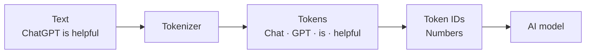

> **A token is a small piece of text that an AI model reads or generates.**

The model does not directly read complete sentences like humans do.

Before processing text, a **tokenizer** breaks it into tokens and converts them into numbers called **token IDs**.

## Simple example

The sentence:

```plain text
ChatGPT is helpful.
```

might be split approximately like this:

```plain text
["Chat", "GPT", " is", " helpful", "."]
```

This example has about **5 tokens**.

> Token boundaries depend on the model's tokenizer. One token is **not always one word**.

> A token may be a whole word, part of a word, punctuation, or even a space combined with text.

## How tokenization works



The model processes the token IDs and predicts the next likely token.

## Tokens are used for both input and output

**Input tokens** include:

- your prompt
- previous conversation messages
- system instructions
- documents provided to the model

**Output tokens** are the tokens generated in the answer.

### Example

Suppose you send a prompt containing **100 tokens**, and the AI returns **300 tokens**.

```plain text
Total tokens used = 100 input tokens + 300 output tokens
                  = 400 tokens
```

## Why tokens matter

<table header-row="true">
<tr>
<td>Reason</td>
<td>Explanation</td>
</tr>
<tr>
<td>Context limit</td>
<td>A model can process only a limited number of tokens at once.</td>
</tr>
<tr>
<td>API cost</td>
<td>AI APIs commonly charge according to input and output token usage.</td>
</tr>
<tr>
<td>Response length</td>
<td>More output tokens allow a longer answer.</td>
</tr>
<tr>
<td>Speed</td>
<td>Processing and generating more tokens usually takes more time.</td>
</tr>
</table>

## Backend example

When calling an AI API, usage may look like:

```json
{
  "input_tokens": 120,
  "output_tokens": 80,
  "total_tokens": 200
}
```

This information is useful for tracking cost and limiting user usage.

## Common misunderstanding

**Wrong:** One token always equals one word.

**Correct:** A token is a piece of text.

A long or unusual word may become several tokens, while a common short word may be one token.

> A rough English estimate is often around **one token for every three to four characters**, but never use this as an exact calculation.

> Different languages and tokenizers behave differently.

## Interview answer

**A token is a small unit of text processed by an AI model. A tokenizer converts text into token IDs, which the model uses to understand the input and generate the next tokens. Tokens affect context limits, API cost, response length, and speed.**
