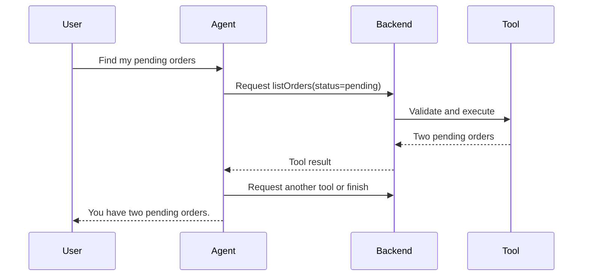

> **Tools allow an agent to read live information or request actions that an LLM cannot perform by generating text alone.**

Examples:

- search orders
- query a database
- calculate a value
- retrieve weather
- send an approved email
- create a support ticket

## Tools make an agent useful

Without tools:

```plain text
User: What is the status of order 123?
LLM: I do not have access to your order system.
```

With a tool:

```plain text
LLM requests getOrderStatus(123)
Backend executes it
Tool returns "shipped"
LLM explains the result to the user
```

## Agent tool loop



The agent may call multiple tools because each result can influence the next decision.

## Defining a good tool

A tool needs:

- clear name
- clear description
- input schema
- narrow responsibility
- predictable output

```javascript
const tool = {
  name: "getOrderStatus",
  description: "Return the status of one order owned by the current user",
  parameters: {
    type: "object",
    properties: {
      orderId: { type: "integer" }
    },
    required: ["orderId"]
  }
};
```

Good descriptions matter because the model uses them to decide which tool fits the task.

## The backend executes the tool

The model may return:

```json
{
  "tool": "getOrderStatus",
  "arguments": {
    "orderId": 123
  }
}
```

Your backend must then:

1. Validate the arguments.
2. Authenticate the user.
3. Check order ownership.
4. Execute the real function.
5. Return the result to the agent.

The model does not bypass backend security.

## Read tools vs action tools

### Read tools

- search documents
- fetch order status
- check calendar availability

These usually have lower risk.

### Action tools

- cancel an order
- send a message
- delete a record
- create a payment

These require stricter permissions and may require user confirmation.

```plain text
Agent proposes cancellation
        ↓
User confirms exact order
        ↓
Backend rechecks permissions and state
        ↓
Cancellation tool executes
```

## Prevent repeated actions

An agent or retry may request the same action twice.

Use:

- idempotency keys
- unique operation IDs
- stored execution state
- duplicate detection

This prevents duplicate emails, orders, or payments.

## Keep tools narrow

Risky:

```plain text
executeAnySQL(query)
```

Safer:

```plain text
getOrderStatus(orderId)
listPendingOrders(userId)
cancelOwnedOrder(orderId)
```

Narrow tools are easier to validate, authorize, and audit.

## Common mistakes

- assuming model-generated arguments are trustworthy
- giving the agent unrestricted database or shell access
- skipping user confirmation
- returning huge tool results to the context
- not limiting tool-call count
- allowing repeated side effects
- exposing secrets inside tool results

> The agent may **request** a tool. Only trusted backend code can approve and execute it.
