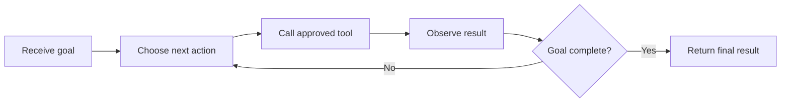

> **An AI agent is a system that uses an AI model to decide which steps or tools to use in order to achieve a goal.**

A normal chatbot mainly answers:

```plain text
User message → LLM → response
```

An agent can continue working:

```plain text
Goal → decide next step → use tool → observe result
     → decide again → stop when complete
```

## Why are agents needed?

Some tasks cannot be completed with one model response.

Example goal:

```plain text
Find my pending orders and cancel any order that has not shipped.
```

The system may need to:

1. Identify the user.
2. Fetch pending orders.
3. Inspect each order's status.
4. Ask for confirmation.
5. Call the cancellation API.
6. Report what happened.

The model alone does not know the live order data and cannot cancel anything. An agent combines the model with backend tools and a controlled execution loop.

## Main parts of an agent

<table header-row="true">
<tr>
<td>Part</td>
<td>Responsibility</td>
</tr>
<tr>
<td>Goal</td>
<td>Defines what should be achieved</td>
</tr>
<tr>
<td>LLM</td>
<td>Chooses or proposes the next step</td>
</tr>
<tr>
<td>Tools</td>
<td>Read data or perform approved actions</td>
</tr>
<tr>
<td>Memory or state</td>
<td>Tracks useful information and completed steps</td>
</tr>
<tr>
<td>Agent loop</td>
<td>Repeats decisions and actions until completion</td>
</tr>
<tr>
<td>Guardrails</td>
<td>Limit what the agent may see and do</td>
</tr>
</table>

## The agent loop



A simplified loop:

```javascript
while (!state.completed && state.steps < MAX_STEPS) {
  const decision = await model.chooseNextAction({
    goal,
    state,
    availableTools
  });

  const result = await executeAllowedTool(decision);
  state = updateState(state, decision, result);
}

return state.finalAnswer;
```

## Chatbot vs agent

<table header-row="true">
<tr>
<td>Chatbot</td>
<td>Agent</td>
</tr>
<tr>
<td>Mainly generates a response</td>
<td>Works toward a goal through multiple steps</td>
</tr>
<tr>
<td>Often one model call</td>
<td>May use several model and tool calls</td>
</tr>
<tr>
<td>Usually does not take actions</td>
<td>Can request approved actions</td>
</tr>
<tr>
<td>Lower cost and complexity</td>
<td>Higher cost and more failure points</td>
</tr>
</table>

## Does every AI feature need an agent?

No.

Use one model call for:

- summarizing text
- extracting fields
- translating
- classifying a ticket
- answering from provided context

Consider an agent when:

- the task requires multiple decisions
- the next step depends on a tool result
- the system must interact with external services
- the path cannot be fully known in advance

## Important safety rules

- expose only narrow tools
- validate every tool argument
- check user permissions in backend code
- require confirmation for destructive actions
- limit steps, time, tokens, and cost
- log tool calls and outcomes
- stop safely when the goal cannot be completed

> An agent is not just an LLM. It is **LLM + tools + state + an execution loop + guardrails**.
